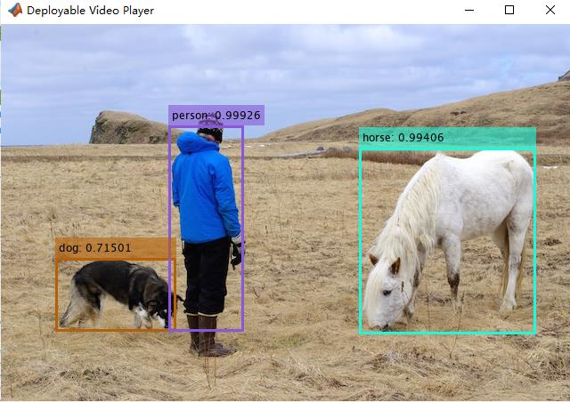
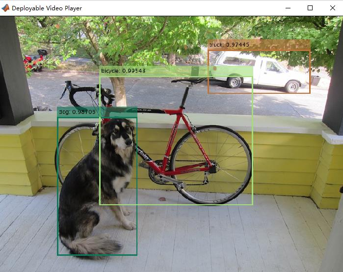

# OverView
Import yolov5*.onnx for inference, including `yolov5s.onnx`, `yolov5m.onnx`, `yolov5l.onnx`, `yolov5x.onnx`, the original output dimension is 1×255×H×W(Other dimension formats can be slightly modified), import (importONNXFunction) + detection in matlab Head decoding output. 
<table style="border:0px">
   <tr>
       <td></td>
       <td></td>
   </tr>
</table>

# Requirements
Matlab R2021a or higher(because onnx version some operator sets need to support up to 12),the newer the better,no other dependencies!!!

# update
- 2021.7.30 support yolox*.onnx for inference
add support for `yolox_nano.onnx`、`yolox_tiny.onnx`、`yolox_s.onnx`、`yolox_m.onnx`、`yolox_l.onnx`、`yolox_darknet53.onnx`、`yolox.onnx`

[onnx model here](https://github.com/Megvii-BaseDetection/YOLOX/tree/main/demo/ONNXRuntime)

# PretrainedModels
baidu disk:[yolov5*.onnx](https://pan.baidu.com/s/1G9yQQ877LuxuAOiCClmtFw ), code：nseh 

# Reference
- [yolov3-yolov4-matlab](https://github.com/cuixing158/yolov3-yolov4-matlab/blob/master/utils/yolov3v4Predict.m ) 
- [yolov5](https://github.com/ultralytics/yolov5/blob/master/models/yolo.py ) 
- [yolox](https://github.com/Megvii-BaseDetection/YOLOX ) 
- [onnxModels](https://github.com/onnx/models) 